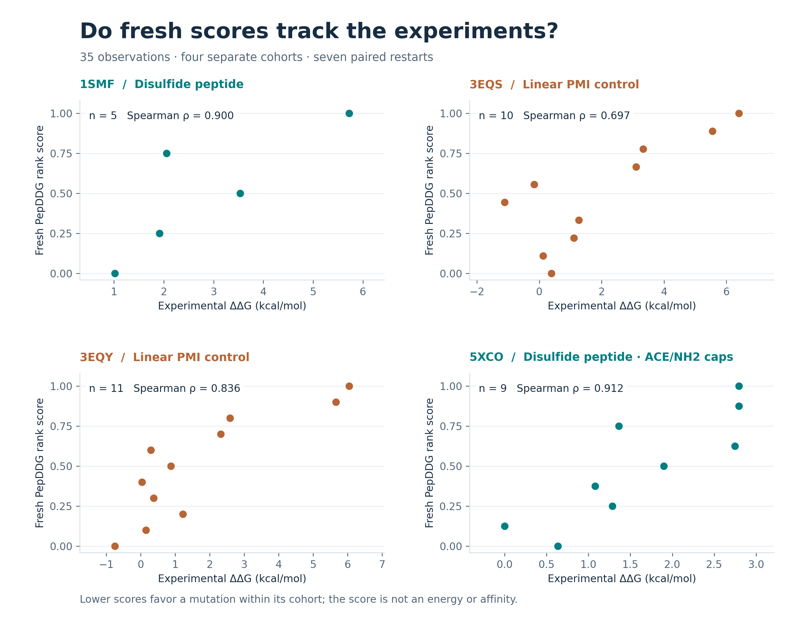

# PepDDG

### From a peptide–protein structure to a ranked mutation shortlist.

**NeurIPS 2026 · CLI + Python API · Reproducible structural examples**

PepDDG helps researchers prioritize single amino-acid substitutions in a
peptide bound to a protein. It combines **physical interaction energies,
local structural context and ProteinMPNN sequence preferences** into a
training-free, cohort-relative mutation ranking.

Supply a complex and a mutation list; get raw features, ranked scores and
traceable run provenance. Use the same interface in a notebook, a shell script
or an automated peptide-optimization workflow.

[Quick start](#quick-start) · [Reproduce the examples](#reproduce-the-paper-targets) ·
[Python API](#python-api) · [中文指南](docs/QUICKSTART.zh-CN.md) ·
[Commercial licensing](#license-and-commercial-use)

## Why PepDDG?

- **Three complementary channels.** Inspect the physics, geometry and sequence evidence behind the final ranking.
- **Structures or features.** Run the complete structure-to-score workflow, or score an existing raw-feature table.
- **Restartable runs.** Completed mutation work survives interruptions; identical-input retries resume it.
- **Examples you can inspect and rerun.** Prepared structures, exact mutation lists, reference outputs and plotting commands are included.

**Read the score correctly:** lower is more favorable within the complete
mutation cohort for one parent–target pair. PepDDG rank scores are dimensionless;
they are not calibrated binding ΔΔG values or experimental affinities.

## Quick start

The complete pinned environment supports Linux x86-64 and Python 3.12:

```bash
git clone https://github.com/zhangruochi/pepddg-release.git
cd pepddg-release
conda env create -f environment.yaml
conda activate pepddg
pepddg doctor --json
```

The environment installs OpenMM, PDBFixer, CPU PyTorch, the bundled
ProteinMPNN checkpoint and PepDDG. The structural workflow defaults to CPU.
CUDA requires a compatible OpenMM CUDA installation; the supplied environment
is the CPU setup. `doctor` checks dependencies and checkpoint presence;
it does not run a prediction or certify a working OpenMM platform.

Try the lightweight scoring interface immediately:

```bash
pepddg score-features \
  --input examples/raw_features.csv \
  --output /tmp/pepddg-scores.csv
```

For feature scoring alone, `python -m pip install .` works in an existing
Python 3.12 environment. Use the conda environment for the structural workflow.

## Rank mutations in your own complex

Prepare a peptide–receptor complex and a CSV of single substitutions:

```csv
mutation,chain,resnum,icode,wt,mut
TI11A,I,11,,T,A
```

Use the chain IDs and residue numbers from **your actual structure**. Supply
all mutations you want to compare together; ranks depend on that cohort.

```bash
pepddg score-structures \
  --structure /path/to/complex.pdb \
  --peptide-chain I --receptor-chain F \
  --mutations /path/to/mutations.csv \
  --target my_target --parent-id WT \
  --output /path/to/pepddg-results
```

The default uses seven paired WT/mutant OpenMM restarts per substitution;
CPU runs can take substantial time. Reissue the identical command to resume
an interrupted run. Successful runs produce:

| Output | What you get |
|---|---|
| `scores.csv` | Mutation identities, channel ranks and the final PepDDG score |
| `features.csv` | Complete raw physical, structural and sequence channels |
| `provenance.json` | Input and checkpoint hashes, seed and scoring protocol |
| `.pepddg-work/` | Restartable per-mutation intermediates |

Supported chemistry includes standard linear peptides and the validated
disulfide topology and exact ACE/NH2 cap graphs in the supplied examples.
Head-to-tail rings, noncanonical residues, linkers and other covalent
chemistries need additional support. Read the [structure and input guide](docs/STRUCTURES.md)
before applying PepDDG to a new molecular system.

## Reproduce the paper targets

After installation, **one command** runs all four supplied SKEMPI v2.0
cohorts from their prepared structures and generates metrics and figures:

```bash
bash examples/skempi_cyclic/run.sh results/skempi-cyclic
```

With a compatible CUDA installation, prefix this command with
`PEPDDG_PLATFORM=CUDA`. This is real feature generation and inference;
experimental labels are read only afterward by the report script.

The checked reference run completed **35 observations, all three channels,
and seven paired restarts**. Results passed the predefined small-cohort
consistency criteria:

| System | Chemistry | Mutations | Paper ρ | Fresh ρ |
|---|---|---:|---:|---:|
| 1SMF | Disulfide peptide | 5 | 0.900 | 0.900 |
| 3EQS | Linear PMI control | 10 | 0.842 | 0.697 |
| 3EQY | Linear PMI control | 11 | 0.718 | 0.836 |
| 5XCO | Disulfide peptide, ACE/NH2 caps | 9 | 0.854 | 0.912 |

ρ is the per-target Spearman correlation with experimental ΔΔG. The paper
groups these four systems as cyclic targets; the deposited 3EQS/3EQY peptides
are linear controls, and the example preserves that chemistry.



For the two true disulfide systems, the mean absolute correlation drift is
**0.029** and mean paper-to-fresh score-order agreement is **0.925**.
These small cohorts support an engineering consistency check, not statistical
equivalence. Prepared inputs omit receptor cofactors and waters and differ
from unavailable historical predicted coordinates.

Explore the [complete reproduction guide](examples/skempi_cyclic/README.md)
for source attribution, topology details, acceptance criteria, raw outputs,
[paper-to-fresh comparisons](examples/skempi_cyclic/results_reference/report/target_correlations.png)
and [ranking scatter plots](examples/skempi_cyclic/results_reference/report/ranking_scatter.png).
Figures are available as high-resolution PNGs and editable SVGs.

To redraw the figures and recompute metrics from the checked reference scores
without running the structural models:

```bash
python examples/skempi_cyclic/report.py \
  --references examples/skempi_cyclic/data/references.csv \
  --results examples/skempi_cyclic/results_reference \
  --output /tmp/pepddg-reference-report
```

## Python API

Score an existing raw-feature cohort in a notebook:

```python
import pandas as pd
from pepddg import score_features

features = pd.read_csv("examples/raw_features.csv")
result = score_features(features)
print(result.table)
```

For structural inference, use `ComplexSpec`, `MutationSpec` and
`run_structural_cohort`; see the [complete Python example](docs/STRUCTURES.md#commands).
The raw-feature interface requires `target`, `parent_id`, `mutation`,
`ddg_xint_iface`, `ddg_bind_proxy`, `n_iface_contacts_8a`, `n_neighbors_10a`,
`mpnn_neg_llr_complex` and `mpnn_ddg_bind`. It rejects mixed cohorts,
duplicates, missing/nonfinite values, experimental labels, precomputed ranks
and extra columns.

## Reproducibility beyond the examples

The historical frozen benchmark has **332 mutations across 33 targets** and
a recorded pooled PepDDG-ZS Spearman correlation near **0.619**. Replay its
feature scoring and metric calculation with:

```bash
python -m pepddg.frozen_benchmark --repo-root . --output /tmp/pepddg-frozen-replay
```

This is a frozen-feature regression, separate from fresh structural inference.
The rebuttal common-coverage cohort contains 331 mutations; it is a different
analysis. See the [benchmark protocol](docs/BENCHMARK.md) and
[data provenance](research/pepddg_v5/data/DATA_PROVENANCE.md).

## License and commercial use

New packaging and structural orchestration use
[PolyForm Noncommercial 1.0.0](LICENSE): **noncommercial research is welcome;
commercial use, including company-internal R&D, requires separate written
authorization**. Contact **<zrc720@gmail.com>** for commercial licensing.

Historical MIT grants and third-party rights remain in force for their
covered materials, including the bundled ProteinMPNN code and checkpoint.
Read [license scope](LICENSE_SCOPE.md) and [third-party notices](THIRD_PARTY_NOTICES.md)
for the combined edition. SKEMPI-derived example data have separate attribution
and licensing, documented in the [example guide](examples/skempi_cyclic/README.md).

## Citation

**PepDDG: Peptide–Protein Binding ΔΔG Prediction via Information Channel
Decomposition.** Accepted to **NeurIPS 2026**.

The final author list and proceedings identifier await verification;
[CITATION.cff](CITATION.cff) will be updated with authenticated metadata.
Do not use the manuscript's anonymous placeholder as a post-acceptance author list.

## Contribute

See [CONTRIBUTING.md](CONTRIBUTING.md) and [CHANGELOG.md](CHANGELOG.md).
Research development stays separate; community releases receive deliberate,
versioned updates. To check the release:

```bash
pytest -q unit_tests/pepddg
python -m pepddg.release_audit --repo-root . --json
```

The artifact audit checks historical frozen-file identity; it does not replace
fresh structural validation.
