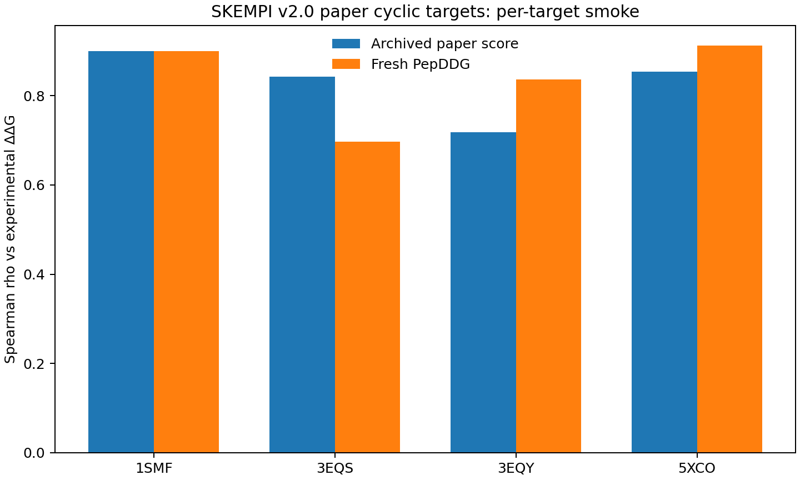

# SKEMPI v2.0 paper cyclic-target reproduction

This example runs the 35 single substitutions associated with the four cyclic
targets used in the PepDDG paper: 1SMF (5 rows), 3EQS (10), 3EQY (11), and 5XCO
(9). It runs the normal PepDDG structural workflow for every target, writes the
three raw channels and cohort-relative scores, and creates a per-target metric
table plus a comparison chart. Experimental labels are loaded only by the
report script, after inference has completed.

The deposited chemistry is preserved. 1SMF and 5XCO have disulfide closures;
5XCO also retains its deposited ACE and NH2 terminal caps. 3EQS and 3EQY are
linear PMI controls even though the paper groups them under “cyclic”. Receptor
calcium, GAI/PO4, GDP/EDO, and waters are omitted by the prepared inputs. The
cofactor-free structures are a reproducible approximation, not the deposited
cofactor-bound systems. Results are a small-cohort consistency check and do not
establish statistical equivalence or experimental affinity.

## Run

Create the supported environment from the repository root, then run:

```bash
conda env create -f environment.yaml
conda activate pepddg
bash examples/skempi_cyclic/run.sh /path/to/output
```

The default execution uses CPU and seven paired OpenMM restarts per mutation;
this may take substantial time. With a compatible OpenMM CUDA build, set
`PEPDDG_PLATFORM=CUDA`. `PEPDDG_CPU_THREADS` controls the CPU thread cap.
Completed output folders can be resumed by rerunning the same command.

The output has one folder per target (`features.csv`, `scores.csv`,
`provenance.json` and restartable `.pepddg-work/`), plus
`report/target_metrics.csv` and `report/target_correlations.png`.

## Reference smoke result

The checked reference run completed all 35 observations with seven paired
restarts and all three channels. Every target met the per-target consistency
limits, and both aggregate cohorts passed. This is a computational consistency
check, not a measurement:

| Target | n | Fresh rho | Paper rho | Absolute drift | Score-order agreement |
|---|---:|---:|---:|---:|---:|
| 1SMF | 5 | 0.900 | 0.900 | 0.000 | 1.000 |
| 3EQS | 10 | 0.697 | 0.842 | 0.145 | 0.867 |
| 3EQY | 11 | 0.836 | 0.718 | 0.118 | 0.891 |
| 5XCO | 9 | 0.912 | 0.854 | 0.059 | 0.850 |



The paper-defined-four group has mean absolute rho drift 0.081 and score-order
agreement 0.902. The true disulfide pair (1SMF and 5XCO) has mean drift 0.029
and agreement 0.925. Raw result tables and provenance for this reference run
are in [`results_reference/`](results_reference/), with source/wheel/input/output
hashes in [`run_manifest.json`](results_reference/run_manifest.json); rerun the
command above to recompute them from structures rather than relying on these
checked-in scores.

The prepared coordinates, mutation lists, and reference rows are derived from
the official [SKEMPI v2.0 download](https://life.bsc.es/pid/skempi2/database/index),
whose database terms are [CC BY 4.0](https://life.bsc.es/pid/skempi2/info/terms).
The `references.csv` file contains experimental labels and archived paper
scores for evaluation only; it must never be supplied to PepDDG inference.
PepDDG code licensing is separate; see the repository [license scope](../../LICENSE_SCOPE.md).

Expected rough consistency criteria for this smoke are per-target absolute
Spearman-rho drift ≤0.20 and score-order agreement ≥0.70. Across the four paper
targets, the mean drift should be ≤0.10 and mean agreement ≥0.90. The separate
true-disulfide pair (1SMF and 5XCO) uses the same aggregate criteria. These
limits were set for this engineering smoke; the small cohorts are not
equivalence intervals. `report.py` reports metrics but does not silently
convert failed limits into a pass.
